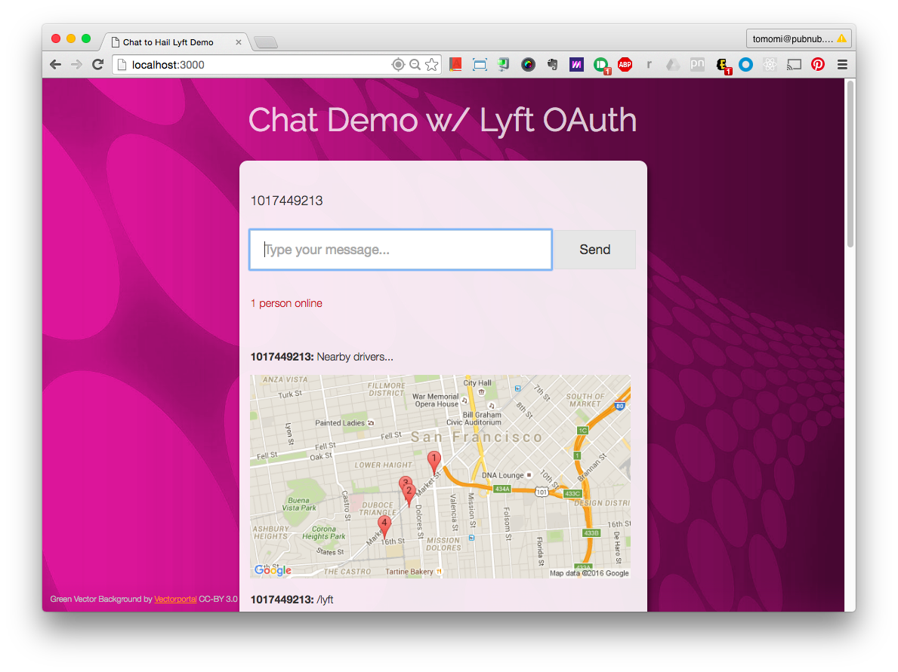

# Lyft OAuth Demo App

The simple chat app to test the passport-lyft OAuth 2 module for Node.js I wrote.



Login with your Lyft credential and just chat. When you use `/lyft`command, it returns you a static map with nearby Lyft (not Line or Plus, because I simply didn't implement for now) drivers.


## Running this App on Local Your Server

Clone the repo then cd to:

```bash
$ cd chat-lyft/server
```

just run node:

```bash
$ node index.js
```

On your browser, go to http://localhost:3000/

